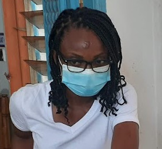

## About Me

Hi! I am a Ph.D student in molecular microbiology at Institut Pasteur de Côte d'Ivoire, in Abidjan. I was born in Lome, Togo were I did my primary school and college before going to
Maroc for undergraduate studies. The amazing project on assessing the bacteriophages effectiveness against multiresistant bacteria sent me to Côte d'Ivoire.

## Research Interest

I am particularly interrested in phages. Their biology, their evolution and their mechanisms. I am also interessted in using them as agent against multidrug resistant bacteria as part of phage therapies.

## Publications

1. **Addablah, A.Y.A.**, Kakou-Ngazoa, S., Akpa, E.E., M’Bourou Ndombi, F., Adioumani, E., Koudou, A., Coulibaly N’Golo, D., Kouame Sina, M., Kouassi, S.K., Aoussi, S., Dosso, M., 2021. Investigation of Phages Infecting Escherichia coli Strains B and C, and Enterobacter cloacae in Sewage and Ebrié Lagoon, Côte d’Ivoire. PHAGE 2, 104–111. https://doi.org/10.1089/phage.2020.0047

2. Addablah, A.A., Kakou-Ngazoa, S., Akpa, E.E., Adioumani, E., Ndombi, F.M., Aoussi, S., Dosso, M., 2021. RAPD-based evaluation revealed genetically diverse populations of Pseudomonas aeruginosa and Staphylococcus aureus lytic bacteriophages isolated in urban sewage and Ebrie Lagoon, Cte dIvoire. AJMR 15, 522–528. https://doi.org/10.5897/AJMR2021.9547

3. Ebou, A., Koua, D., **Addablah, A.**, Kakou-Ngazoa, S., Dutertre, S., 2021. Combined Proteotranscriptomic-Based Strategy to Discover Novel Antimicrobial Peptides from Cone Snails. Biomedicines 9, 344. https://doi.org/10.3390/biomedicines9040344

4. Solange, K.-N.E., **Audrey, A.A.**, Katerina, K., Daniel, S., St&ephane, K.K., David, C.N., Mireille, S.K., Serge, A., Charles, D., Mireille, D., 2020. First novel phages from rodents with lytic activity on clinical Enterobacteriaceae strains: Initiation for phage therapy in West Africa. AJMR 14, 280–285. https://doi.org/10.5897/AJMR2020.9329

5. Koudou, A.A., Kakou-Ngazoa, S., Konan, F.K., Aka, E., **Addablah, A.**, N’Golo, C.D., Kouassi, S., Sina, K.M., Atta, H.D., Guessend, N., Ahoussi, S., Dosso, M., 2020. Occurrence of multidrug-resistant bacteria in aquaculture farms in Cte dIvoire (West Africa). Afr. J. Microbiol. Res. 14, 182–188. https://doi.org/10.5897/AJMR2019.9277

6. Koudou, A.A., Kakou-Ngazoa, S., **Addablah, A.**, Allali, K.B., Aoussi, S., Atta Diallo, H., Dosso, M., 2020. Biocontrôle de l’infection à Pseudomonas aeruginosa multi-résistant par les bactériophages en aquaculture en Côte d’Ivoire. JABs 154, 15940–15949. https://doi.org/10.35759/JABs.154.10

7. Ngazoa-Kakou, S., Shao, Y., Rousseau, G.M., **Addablah, A.A.**, Tremblay, D.M., Hutinet, G., Lemire, N., Plante, P.-L., Corbeil, J., Koudou, A., Soro, B.K., Coulibaly, D.N., Aoussi, S., Dosso, M., Moineau, S., 2019. Complete Genome Sequence of Escherichia coli Siphophage BRET. Microbiology Resource Announcements. https://doi.org/10.1128/MRA.01644-18

## Typography

This is a [link](http://google.com). Something *italics* and something **bold**.

Here is a table

Year | Award | Category
-----|-------|--------
2014 | Emmy  | Won Outstanding Lead Actor in a miniseries or a movie
2015 | BAFTA | Nominated for Best Leading Actor for Sherlock
2014 | Satellite | Won Best Actor miniseries or television film

Here is a horizontal rule

---

Here is a blockquote

> To a great mind, nothing is little

## References

* Solange Kakou-Ngazoa: Head of Molecular biology platform, Institut Pasteur de Côte d'Ivoire
* Eric A. Essoh: Associate Professor, Department of Computer Science, Université Félix Houphouët-Boigny
* Dominique Koua: Assistant Professor, Departement Agriculture et Ressources Animales, INP-HB
